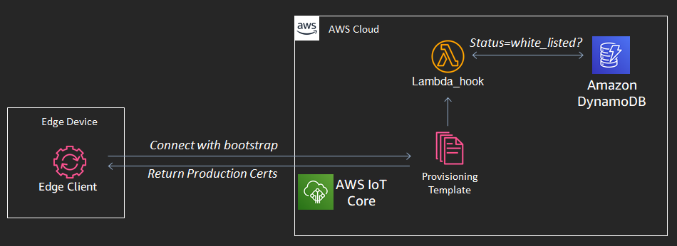

# IoT Fleet Provisioning with On Demand Systems Manager


AWS Systems Manager (SSM) provides a range of services including the ability to run commands managed instances based on tag, the ability to Secure Shell (SSH) into a managed instances for troubleshooting, application package management, and operating system patching. SSM agent can be installed on Windows, Linux, and Mac devices to extend this functionality to on-prem edge devices. This added edge functionality can enrich management and control of IoT applications but SSM has an hourly pricing model that is not designed for low cost IoT devices that only occasionally require SSM.

This repo provides the cloud and edge infrastructure for on-demand SSM to allow for temporarily using SSM features to manage IoT devices at a price point that is competitive in the IoT market. This involves using inexpensive MQTT messaging as the primary communication between edge devices and the cloud and then allowing an admin to toggle SSM on or off for any specific IoT device or group of devices with the same tag. The edge client in this repo is designed for a Linux and Windows edge devices and has been tested on Windows 10 and Raspberry Pi.


## Getting Started
This section provides steps to get started and to manage OS updates.

### Requirements
Windows (logged in as admin) or Linux Edge Device (with permissions to sudo)  
AWS CLI  
Python 3.7  

### Cloud Setup

These steps only need to be completed once per AWS account.

#### Step 1 - Copy this repository to Codecommit:

Having this code in your AWS account will create a development environment for your engagement. As you're building out your business logic, each remote push to your repo will kick-off the pipeline and stage the appropriate changes in IoT Core, for deployment to your edge device.

1. Create a CodeCommit repository for this project. This will be your remote repository.

    ```
    aws codecommit create-repository --repository-name <RepoName> --repository-description "<Description>" 
    ```

    example 
    ```
    aws codecommit create-repository --repository-name ssmOnDemand --repository-description "SSM On Demand Project" 
    ```


2. On local machine, create a temporary folder and clone this repo to that folder. Change to that directory and clone via below
    ```
    git clone --mirror ssh://git.amazon.com/pkg/ssmOnDemand <RepoName>
    ```

    ```
    git clone --mirror ssh://git.amazon.com/pkg/ssmOnDemand ssmOnDemand
    ```

3. Push the code from this repo to CodeCommit. 
    Change directory to the new temporary repo folder. NOTE: If you haven’t authenticated with CodeCommit before make sure and visit IAM/Security credentials tab to create CodeCommit credentials. You will be asked for these credentials when you push to Codecommit.

    ```
    git push https://git-codecommit.<Region>.amazonaws.com/v1/repos/<RepoName> --all 
    ```
    example
    ```
    git push https://git-codecommit.us-east-1.amazonaws.com/v1/repos/ssmOnDemand --all 
    ```


4. Delete the local temporary folder and contents that were created in step #2 above. Your newly populated repo can be seen in CodeCommit in the AWS Console.

5. Clone this repo into a local dev directory. This will be your working tree for any new custom development/orchestration. The pipeline will rebuild and stage a release for any commits that that are pushed to the mainline branch.

    ```
    git clone https://git-codecommit.<Region>.amazonaws.com/v1/repos/<RepoName> <RepoName>
    ```
    example
    ```
    git clone https://git-codecommit.us-east-1.amazonaws.com/v1/repos/ssmOnDemand ssmOnDemand
    ```

#### Step 2 - Deploy cloud infrastructure using CloudFormation

Use the command below to install infrastructure into your account. This template will dynamically create an edge client and bootstrap certificates for your account. These resources are uploaded to an Amazon S3 bucket named {ResourceTag}-iot-{rootstackId}-{ResourceTag}-{stackId}. The full name of the S3 bucket as also provided as an output of the root stack.

After initial deployment, cloud updates should be performed by updating the AWS Serverless Application Modem (SAM) template.yaml file from this repository or files referenced by the template.yaml file. All updates pushed to AWS CodeCommit will be built and deployed as CloudFormation templates. Pipeline.yaml creates a pipeline using CodeCommit, AWS CodeBuild, and AWS CodeDeploy. After deployment, updates to template.yaml and resources referenced by template.yaml in this CodeCommit repository will push updates to AWS infrastructure via CloudFormation. All template.yaml files in this repository are SAM templates. Codebuild uses instructions in the buildspec.yaml file to transform the SAM templates in this repository to CloudFormation templates for deployment. 

```
aws cloudformation create-stack --region PUT-REGION-HERE --stack-name PUT-STACK-NAME-HERE --template-body file://pipeline.yaml --capabilities CAPABILITY_NAMED_IAM --parameters ParameterKey=CodeRepositoryName,ParameterValue=PUT-REPO-NAME-HERE ParameterKey=CodeRepositoryBranch,ParameterValue=PUT-BRANCH-HERE ParameterKey=ResourceTag,ParameterValue=PUT-RESOURCE-TAG-HERE --profile PUT_PROFILE_HERE
```

Example:

```
aws cloudformation create-stack --region us-east-1 --stack-name ssmOnDemandPipeline --template-body file://pipeline.yaml --capabilities CAPABILITY_NAMED_IAM --parameters ParameterKey=CodeRepositoryName,ParameterValue=ssmOnDemand ParameterKey=CodeRepositoryBranch,ParameterValue=mainline ParameterKey=ResourceTag,ParameterValue=ssmOnDemand --profile default
```


### Edge Device Setup

1. Obtain stack output values for ClientBucket and ToggleSSMLamba for later steps.

``` aws cloudformation describe-stacks --stack-name <name> --profile <value> ```

Example:

``` aws cloudformation describe-stacks --stack-name ssmondemand --profile default ```

2. Download client.zip from the S3 bucket (ClientBucket from 1) to your edge device and unzip.

3. Open machine_config.json and enter a unique value for "device_id" or use the pre-entered example value '12345ABCD' to easily use example commands in the following steps.

4. White list device for certification in dynamodb.  

``` aws dynamodb put-item --table-name <ResourceTag> --item "{\"device\": {\"S\": \"<device-id>\"}, \"state\":{\"S\":\"white_listed\"}}" --profile <value>```  
Example:  
``` aws dynamodb put-item --table-name ssmondemand --item "{\"device\": {\"S\": \"12345ABCD\"}, \"state\":{\"S\":\"white_listed\"}}" --profile default ```  

5. Install Python requirements.

Change directory to the unzipped client folder and then run the following command to install the neccessary Python client dependendencies.

Windows  
``` pip install -r requirements.txt ```
Linux  
``` sudo pip3 install -r requirements.txt ```

6. Run client and click to accept to run as admin. The first execution will exchange bootstrap certificates for production certificates. After you have production certificates run client again.  
Windows  
``` python main.py ```  
Linux  
``` sudo python3 main.py ```

7. Toggle on SSM with AWS Lambda where the Lambda name is the value of the CloudFormation ouput ToggleSSMLamba (from 1 above). Use a separate terminal from the client to execute the following command. The Lambda response will be logged in response.json.  

 ``` aws lambda invoke --function-name <name> --payload "{\"device_id\": \"<device_id>\", \"action\":\"activate\"}" --profile <value> response.json ```  

Example:  

``` aws lambda invoke --function-name ssmondemand-SSM-N2W0CKXQKXNI-ToggleSSMFunction-RUBRX5I4Y4B6 --payload "{\"device_id\": \"12345ABCD\", \"action\":\"activate\"}" --profile default response.json ```  

8. (Optional) Use SSM managed instance console to SSH into device or perform run commands such as os patching.   

9. Toggle off SSM with Lambda where the Lambda name is the value of the CloudFormation ouput ToggleSSMLamba (from 1 above). The Lambda response will be logged in response.json.  

 ``` aws lambda invoke --function-name <name> --payload "{\"device_id\": \"<device_id>\", \"action\":\"deactivate\"}" --profile <value> response.json ```  

Example:  

``` aws lambda invoke --function-name ssmondemand-SSM-N2W0CKXQKXNI-ToggleSSMFunction-RUBRX5I4Y4B6 --payload "{\"device_id\": \"12345ABCD\", \"action\":\"deactivate\"}" --profile default response.json ```  
 

## Additional Infrastructure Details
The section describes the architecture and Lambda functions used in this project.

### Architecture

The fleet provisioning by claim setup in this project uses the automated resource creation from [automated-fleet-provisioning-by-claim](https://github.com/aws-samples/automated-iot-fleet-provisioning-by-claim) and communcates with Amazon DynamoDB to determine white listed devices (image below).



Temporarily installing and registering an edge device for SSM management involves triggering a Lambda function to execute the following steps (image below).  
1. Manually invoke the toggle_ssm Lambda function with device_uuid and action="activate" as inputs
2. Confirm device state in DynamoDB
3. Create SSM hybrid activation
4. Send activation Id/Code to DynamoDB and publish to MQTT topic for device
5. Install SSM agent on edge device
6. Activate SSM agent and register instance
7. Inventory update triggers CloudWatch event
8. Invoke setup_instance_registered Lamdba
9. Add managed instance_id to DynamoDB
10. Poll DynamoDB for instance_id until timeout. On match, return id. On timeout, clear activation


The same Lambda function is used to deactivate a registered edge device (image below).
1. Manually invoke the toggle_ssm Lambda function with device_uuid and action="deactivate" as inputs
2. Get activation data and instance_id from DynamoDB and then clear these key/value pairs from the DynamoDB entry for the device
3. Delete SSM activation for this device and deregister the corresponding instance in SSM
4. Publish to the MQTT deactivation topic for the device
5. Uninstall SSM agent at edge


### Lambda Functions

1. FleetProvisioningFunction: 
Location: SubTemplates\IoT\Lambdas\provision_device\app.py  
Trigger: Template creation  
Actions:  
    - Create edge client and save to S3
    - Create provisioning template, bootstrap policy, and production policy  
    - Clear all resources on delete

2. FleetProvisioningHookFunction:  
Location: SubTemplates\IoT\Lambdas\lambda_hook\app.py  
Trigger: Fleet-provisioning client publishing to topic  
Actions:  
    - Check DynamoDB for device and confirm state="white_listed" to approve 

3. SetupInstanceFunction:  
Location: SubTemplates\SSM\Lambdas\setup_instance_registered\app.py  
Trigger: CloudWatch Event occuring from device being registered in SSM   
Actions:  
    - Check SSM to confirm instance has a project tag with value equal to the Resource_Tag  
    - Add instance id to device data in DynamoDB  

4. SsmSetupFunction:  
Location: SubTemplates\SSM\Lambdas\setup_ssm\app.py  
Trigger: Template creation  
Actions:  
    - Create SSM association AWS-GatherSoftwareInventory for all instances

5. ToggleSSMFunction:  
Location: SubTemplates\SSM\Lambdas\toggle_ssm\app.py  
Trigger: Manual invocation with payload:
    ```
    {
        "device_id": <id>,
        "action": <action>
    }
    ```  

    where action is "activate" or "deactivate"  
Actions:  
    1) Activation  
        - Create SSM hybrid activation  
        - Save activation details to DynamoDB  
        - Publish activation details as payload to MQTT topic containing edge device id   
        ```cmd/${device_id}/ssm/activate```  
        - Poll DynamoDB every 5s until instance_id is available. If available, return SSM managed instance_id. If not available by timeout, clear SSM activation details  
    2) Deactivation  
        - Publish message to deactivation MQTT topic containing edge device id  
        ```cmd/${device_id}/ssm/deactivate```   
        - Delete SSM activation  
        - Update DynamoDB  
        - Deregister instance in SSM  
 
6. cleanupBucketOnDeleteLambda:  
Location: pipeline.yaml inline code  
Trigger: Template creation  
Actions:  
    - Delete all items in pipeline S3 bucket on template delete  

## Infrastructure Teardown
Teardown removes all SSM managed instances and IoT things/resources created using the edge client  

1. Delete the CloudFormation root stack  
 